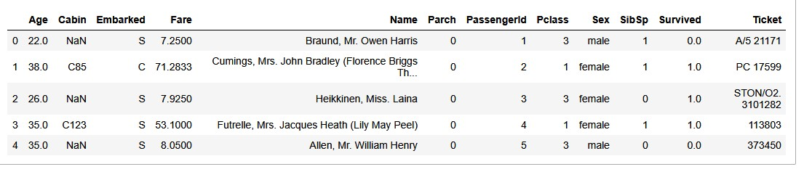
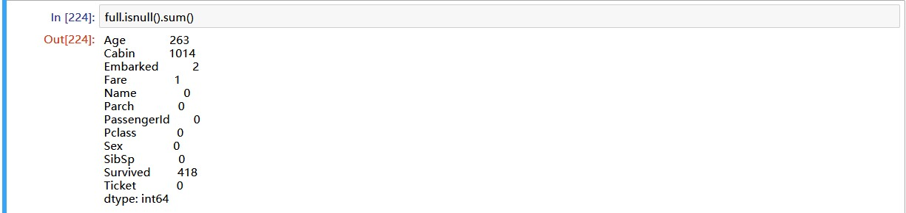
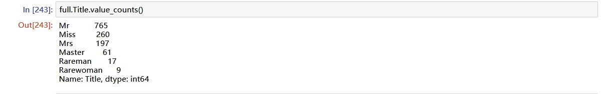
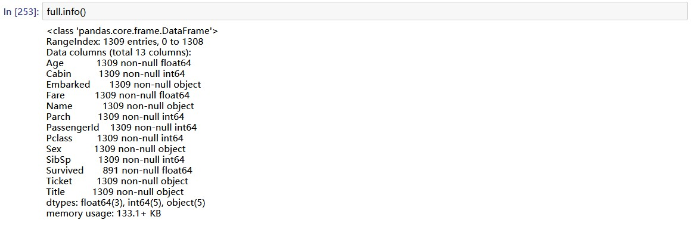
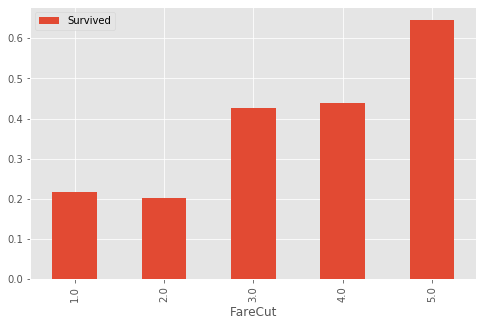
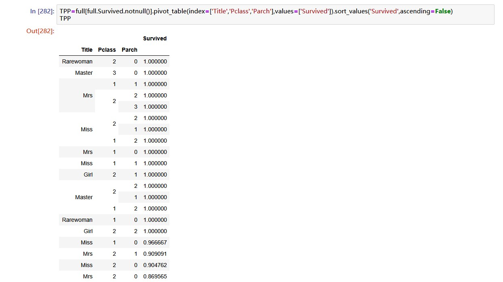
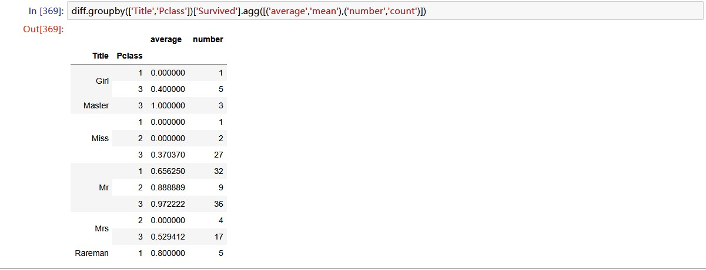
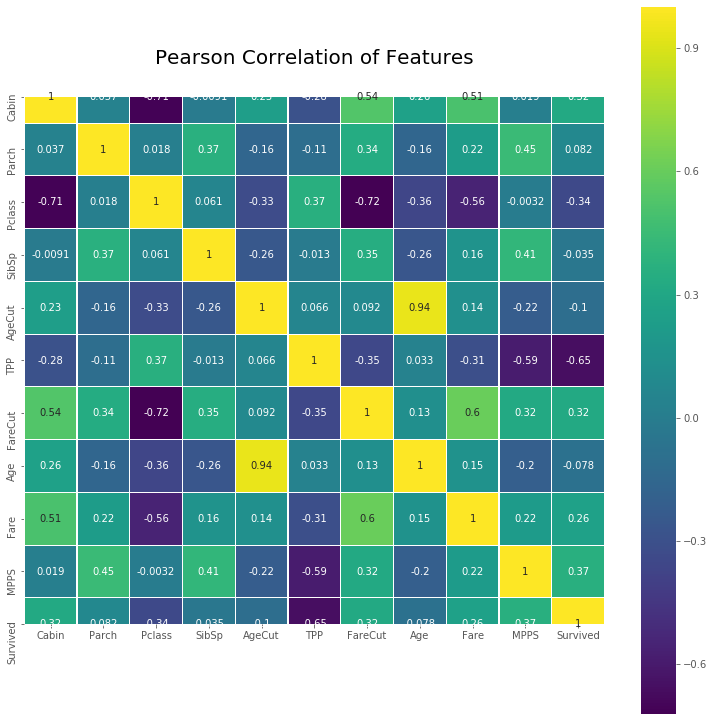
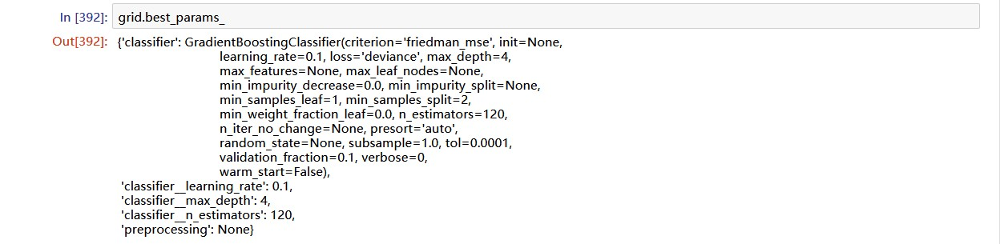

# kaggle入门竞赛-泰坦尼克号

## 比赛说明

> The sinking of the Titanic is one of the most infamous shipwrecks in history.
>
> On April 15, 1912, during her maiden voyage, the widely considered “unsinkable” RMS Titanic sank after colliding with an iceberg. Unfortunately, there weren’t enough lifeboats for everyone onboard, resulting in the death of 1502 out of 2224 passengers and crew.
>
> While there was some element of luck involved in surviving, it seems some groups of people were more likely to survive than others.
>
> In this challenge, we ask you to build a predictive model that answers the question: “what sorts of people were more likely to survive?” using passenger data (ie name, age, gender, socio-economic class, etc).

## 一、数据分析
### 数据的下载与观察

- [数据下载](https://www.kaggle.com/c/titanic/data)

- 特征说明

| Varialbe | Definition | Key |
| :------: | :--------: | :-: |
| survival | Survival | 0 = NO, 1 = Yes |
| pclass | Ticket class | 1 = 1st, 2 = 2nd, 3 = 3rd |
| sex | Sex | |
| Age | Age in years | |	
| sibsp | # of siblings / spouses aboard the Titanic | |	
| parch	| # of parents / children aboard the Titanic | |
| ticket | Ticket number | |	
| fare | Passenger fare | |	
| cabin	| Cabin number | |	
| embarked | Port of Embarkation | C = Cherbourg, Q = Queenstown, S = Southampton |

### 特征详情



## 二、数据工程

### 特征处理

我们首先看看数据有没有缺失值：



发现'Age'、'Cabin'、'Embarked'和'Fare'有缺失值：

- 'Embarked'用众数填充；
- 'Fare'和'Pclass'相关，所以用和缺失值相同的'Pclass'样本的'Fare'中位数填充；
-  'Cabin'缺失值，用是否有'Cabin'为依据来填充，'Cabin'不为空填1，为空填0；
-  'Age'我们用构建其他特征的方式来处理;

我们通过提取'name'中的称呼，构建了一个特征'Title'：



查看'Master'的'Age'，可以看出'Master'是小男孩，我们希望把小女孩也找出来：

```python

full.Age.fillna(999, inplace=True)


def filter_girl(person):
    if(person.Age != 999)  and  (person.Age <= 14) and (person.Title == 'Miss'):
        return 'Girl'
    if(person.Age == 999)  and  (person.Parch != 0) and (person.Title == 'Miss'):
        return 'Girl'
    return person.Title


full['Title'] = full.apply(filter_girl, axis=1)

```
最后，我们根据'Title'来的'Age'中位数来填充'Age'的缺失值：

```python
Tit=['Mr','Miss','Mrs','Master','Girl','Rareman','Rarewoman']
for i in Tit:
    full.loc[(full.Age==999)&(full.Title==i),'Age']=full.loc[full.Title==i,'Age'].median()

```
现在我们完成了了对缺失值的处理。




### 构建新特征
- 对'Fare'进行分箱,构建'FareCut'
- 对'Age'进行分箱,构建'AgeCut'
```python

full.AgeCut = pd.cut(full.Age, 5)
full.FareCut = pd.qcut(full.Fare, 5)

full.loc[full.Age<=16.136,'AgeCut']=1
full.loc[(full.Age>16.136)&(full.Age<=32.102),'AgeCut']=2
full.loc[(full.Age>32.102)&(full.Age<=48.068),'AgeCut']=3
full.loc[(full.Age>48.068)&(full.Age<=64.034),'AgeCut']=4
full.loc[full.Age>64.034,'AgeCut']=5

full.loc[full.Fare<=7.854,'FareCut']=1
full.loc[(full.Fare>7.854)&(full.Fare<=10.5),'FareCut']=2
full.loc[(full.Fare>10.5)&(full.Fare<=21.558),'FareCut']=3
full.loc[(full.Fare>21.558)&(full.Fare<=41.579),'FareCut']=4
full.loc[full.Fare>41.579,'FareCut']=5
```


再将'Title', 'Parch'和'Pclass'综合考虑，看看存活率。


构建特征'TPP':

```python
# use 'Title','Pclass','Parch' to generate feature 'TPP'.
Tit=['Girl','Master','Mr','Miss','Mrs','Rareman','Rarewoman']
for i in Tit:
    for j in range(1,4):
        for g in range(0,10):
            if full.loc[(full.Title==i)&(full.Pclass==j)&(full.Parch==g)&(full.Survived.notnull()),'Survived'].mean()>=0.8:
                full.loc[(full.Title==i)&(full.Pclass==j)&(full.Parch==g),'TPP']=1
            elif full.loc[(full.Title==i)&(full.Pclass==j)&(full.Parch==g)&(full.Survived.notnull()),'Survived'].mean()>=0.5:
                full.loc[(full.Title==i)&(full.Pclass==j)&(full.Parch==g),'TPP']=2
            elif full.loc[(full.Title==i)&(full.Pclass==j)&(full.Parch==g)&(full.Survived.notnull()),'Survived'].mean()>=0:
                full.loc[(full.Title==i)&(full.Pclass==j)&(full.Parch==g),'TPP']=3
            else: 
                full.loc[(full.Title==i)&(full.Pclass==j)&(full.Parch==g),'TPP']=4

full[full.Survived.notnull()].pivot_table(index=['Sex','Pclass'],values=['Survived']).sort_values('Survived',ascending=False)

full.ix[(full.TPP==4)&(full.Sex=='female')&(full.Pclass!=3),'TPP']=1
full.ix[(full.TPP==4)&(full.Sex=='female')&(full.Pclass==3),'TPP']=2
full.ix[(full.TPP==4)&(full.Sex=='male'), 'TPP']=3

```


## 三、建立模型
使用交叉验证法来训练模型，模型包括：

- KNN
- Logistic Regression
- Random Forest
- SVM
- Gradient Boosting Decision Tree

```python
from sklearn.model_selection import cross_val_score
from sklearn.neighbors import KNeighborsClassifier
from sklearn.linear_model import LogisticRegression
from sklearn.ensemble import RandomForestClassifier
from sklearn.ensemble import GradientBoostingClassifier
from sklearn.svm import SVC
from sklearn.preprocessing import StandardScaler

models = [KNeighborsClassifier(), LogisticRegression(), RandomForestClassifier(), 
         GradientBoostingClassifier(), SVC()]

X_train = full_dummies[: 891]
y_train = full.Survived[: 891]
X_test = full_dummies[891 :]


scaler = StandardScaler().fit(X_train)
X_train_scaled = scaler.transform(X_train)
X_test_scaled = scaler.transform(X_test)

names = ['KNN', 'LR', 'RF', 'GBDT', 'SVM']
for name, model in zip(names, models):
    score = cross_val_score(model, X_train_scaled, y_train, cv=5)
    print('{}:\nmean:{:.2f}\n{}\n'.format(name, score.mean(), score))
```
得出结果：

- KNN:
    - mean:0.81
    - [0.82122905 0.77653631 0.80337079 0.80898876 0.83615819]

- LR:
    - mean:0.83
    - [0.82681564 0.81564246 0.8258427  0.83146067 0.86440678]

- RF:
    - mean:0.81
    - [0.82681564 0.77653631 0.84269663 0.76966292 0.83615819]

- GBDT:
    - mean:0.84
    - [0.8547486  0.80446927 0.86516854 0.80337079 0.87570621]

- SVM:
    - mean:0.83
    - [0.82681564 0.82681564 0.83146067 0.79775281 0.8700565]

可以看出， GBDT的表现最好。

我们在对分类错误的样本进行观察：




我们重点关注那些错误分类数目多的样本，就是：

- 'Mr','Pclass 1','Parch 0','SibSp 0\1', 17+8
- 'Mr','Pclass 2\3','Parch 0','SibSp 0', 32+7
- 'Miss','Pclass 3','Parch 0','SibSp 0', 21

我们再构造一个特征'MPP':
```python
full.loc[(full.Title=='Mr')&(full.Pclass==1)&(full.Parch==0)&((full.SibSp==0)|(full.SibSp==1)),'MPPS']=1
full.loc[(full.Title=='Mr')&(full.Pclass!=1)&(full.Parch==0)&(full.SibSp==0),'MPPS']=2
full.loc[(full.Title=='Miss')&(full.Pclass==3)&(full.Parch==0)&(full.SibSp==0),'MPPS']=3
full.MPPS.fillna(4,inplace=True)

```
最后画一下相关系数热图：




## 四、模型优化

下面利用网格搜索来查找表现好的模型和模型参数：

```python
from sklearn.model_selection import GridSearchCV
from sklearn.pipeline import Pipeline

predictors=['Cabin','Embarked','Parch','Pclass','Sex','SibSp','Title','AgeCut','TPP','FareCut','Age','Fare','MPPS']
full_dummies=pd.get_dummies(full[predictors])

X_train=full_dummies[:891]
y_train=full.Survived[:891]
X_test=full_dummies[891:]

X_train_scaled = scaler.fit(X_train).transform(X_train)
X_test_scaled = scaler.transform(X_test)


pipe = Pipeline([('preprocessing', StandardScaler()), ('classifier', SVC())])
param_grid = [{'classifier' : [KNeighborsClassifier()], 'preprocessing' : [None], 'classifier__n_neighbors' : [1,2,3,4,5,6,7,8,9]},
             {'classifier' : [LogisticRegression()], 'preprocessing' : [None], 'classifier__C' : [0.001, 0.01, 0.1, 1, 10]},
             {'classifier' : [SVC()], 'preprocessing' : [None], 'classifier__gamma' : [0.001, 0.01, 0.1, 1, 10], 'classifier__C' : [0.001, 0.01, 0.1, 1, 10]},
             {'classifier' : [GradientBoostingClassifier()], 'preprocessing' : [None], 'classifier__n_estimators' : [30,50,80,120,200], 
              'classifier__learning_rate' : [0.05,0.1,0.5,1], 'classifier__max_depth' : [1,2,3,4,5]}]

grid = GridSearchCV(pipe, param_grid=param_grid, cv=5)
grid.fit(X_train_scaled, y_train)

```



现在我们找到了表现最好的模型和对应参数，下面我们来对测试集进行预测:

```python
y_predict = grid.predict(X_test_scaled)
result = pd.DataFrame({'PassengerId' : test.PassengerId, 'Survived' : y_predict})
result.to_csv('data/result.csv', index=False)

```

